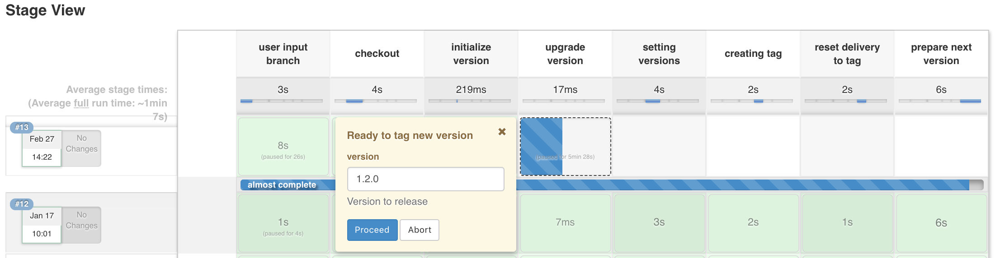

# Jenkins tools

## Goal

This groovy script library is made to create easily a pipeline in jenkins

Example of some pipelines steps commonly used :

- Build backend (compile, test, quality analyse, package)
- Build frontend (install dependencies, generate frontend configuration)
- Archive previous packaged into jenkins artifacts
- Notify bitbucket about pipeline progression
- ...




## How to use it

Create a file with a naming like "Jenkinsfile" or "JenkinsfileDeploy" or "JenkinsfileRelease"

(depending on the script purpose : build or deploy or release)

```groovy
#!/usr/bin/groovy
@Library("jenkins-tools@1.7.1") _

releasePackage {
    projectName = 'my-project'
    ...
}
```

The `@Library` will enable an external library (defined in jenkins)

"jenkins-tools" here is the name of the external library to use.
Every public api of this library will be available for the next script lines.

`@1.7.1` refers to a git tag name from this library.

By convention : 

- `@X.Y.Z` is a stable version (where X.Y.Z represents a version number)
- `@branch-name` is a unstable version (where branch-name represents the library git branch name)

`releasePackage { ... }` is one of the available apis in jenkins-tools.

## Available Apis

### Backend pipeline

```
backend.build {
    directory = <string>
    build = [
            profiles     : <string>,
            test         : <map>,
            sonar        : <map>,
            notifications: <map>,
            archiveParams: <map>,
            deployNexus  : <true|false>,
            frontendBuild: <true|false>,
            devBranch    : <string>
    ],
    externalServiceDirectories: < array<string> >
}
```

All parameters in build pipeline are optionals

- `directory : <string>` directory in which one the backend is located 
(where you find the pom.xml)
- `build : <map>` define build related parameters`
    - `profiles : <string>` profile to add (-P parameter) to maven build
        - `profile = 'dev'` -- if current branch is not 'delivery'
        - `profile = 'prod'` -- if current branch is 'delivery'
    - `test : <map>` parameters to pass to tests phase
        - `default: [skipTests: false]`
    - `sonar: <map>` parameters to pass to sonar goal
        - `default: [enabled: true]`
    - `notifications: <map>` key and name for bitbucket push notifications
    - `deployNexus: <boolean>` activate the maven deploy phase (only for dev and delivery branches)
    - `archiveParams: <map>` enable or disable jar/war and properties (yml) push to dist folder
        - `default: [doArchive: true]`
    - `frontendBuild: <boolean>` activate if backend folder is composed with
    a frontend to build (with npm for the moment)
    - `devBranch: <string>` main development branch name (defaults to dev)
- `externalServiceDirectories: < array<string> >` path to external service folders.
An external service is another maven project (library for example) needed to be 
installed (mvn install) to give the ability to backend to refer it as a library during
build time

### Frontend pipeline

```
frontend.build {
    installDeps = <true|false>
    directory = <string>
    build = [
      dev           : <map>
      delivery      : <map>,
      test          : <map>,
      notifications : <map>
      builderTool   : <npm|yarn>
    ]
  }
```

Parameters :

- `installDeps: <boolean>` true if you want to launch builder "install" phase
- `directory: <string>` string represents the location of frontend root folder
- `build: <map>` defines build parameters
    - `dev: <map>` needs a `environments` key defining for which environment the dev profile is added. These environments configuration will only be built on main development branch
        - `default: dev: [ environments: ['dev', 'staging'] ]`
    - `delivery: <map>` needs a `environments` key defining for which environment the prod profile is added. These environments configuration will only be built on delivery branch 
        - ` No default value ! `
    - `test: <map>` defines test phase parameters
        - `default: test: [ skipTests: false ]` 
    - `notifications: <map>` key and name for bitbucket push notifications
    - `builderTool: <npm|yarn>` (default: npm) defines the dependency and build manager to use
    
### Docker tools

#### docker build pipeline
```
node("docker") {
    gitUtils.checkoutStageWithDist()

    backend.build { }
    
    dockerTool.build { 
        backendDirectory = <string>
    }
}
```

dockerTool.build{ } need to contain a Dockerfile at `<backendDirectory_folder>`

It will launch a docker build command (retrieving the docker image name from `project.artifactId` 
in pom.xml

It will then trigger a docker push (to docker image registry, currently `nexus`) 

- `backendDirectory : <string>` (optional) (defaults: project root folder)

### Deployment pipeline

#### jenkins artifacts deployment

Example
```
deployment.pipeline([
        config: [
                projectName: 'lisa',
                strictHostKeyChecking: false,
                environments: [
                        dev:        [ server: 'lisa-dev.lab' ],
                        staging:    [ server: 'lisa-staging.lab' ],
                        uat:        [ server: 'lisa-uat.lab' ]
                ],
                deployments: [
                        front:           [ file : "lisa-front-${params.BUILD_ENV}.zip", type: 'frontend' ],
                        gateway:         [ file : "lisa2-*.war", type: 'backend' ],
                        "gateway-yml":   [ file : "application-${params.BUILD_ENV}.yml", type: 'yml' ]
                ]
        ],
        params: params
])
```

- `type: no_value` defaults to jenkins artifacts deployment
- `config: <map>` defines configuration for environment onto which artifacts will be deployed
    - `projectName: <string>` (mandatory) used to locate the multibranch pipeline (same level as projectName-tasks folder)
    - `strictHostKeyChecking: <boolean>` (optional) useful to not being asked for ssh key storage at first ssh connexion
    - `environments: <map>` (mandatory) describes association between jenkins job parameter (`BUILD_ENV`) and the associated host
    - `deployments : <map>` (mandatory) describes which files need to be picked up from build pipeline to deploy onto the host. `type` is needed to launch specific deployment script into the host
- `params: params` (mandatory) passes job parameters to library (`BUILD_ENV` and `ARCHIVE_BUILD_NUMBER`)

#### docker deployment

```
deployment.pipeline([
        type: 'docker',
        config: [
                projectName: 'erac-bot',
                options: "-e SPRING_PROFILES_ACTIVE='prod'"
        ]
])
```

docker deployment pipeline will execute the following steps :

- retrieves image from docker registry
- stop the current container
- remove the current container
- remove the current image with tag `projectName:current`
- tag the new image with `projectName:latest` and `projectName:current`
- run the latest version of projectName

Parameters

- `type: 'docker'` enables the docker deployment (using jenkins slave named 'docker')
- `config : <map>`
    - `projectName : <string>` (mandatory) name of docker image to deploy
    - `options: <string>` (optional) command line to pass when image will be run

### Release pipeline
### Mobile pipeline
### Git utils

#### checkoutStageWithDist
```
node {
    gitUtils.checkoutStageWithDist()
}
```

checkoutStageWithDist method will checkout the project and create a dist folder

See [Artifacts part](#artifacts) for dist folder informations

### Artifacts

#### archiveAll

```
node {
    gitUtils.checkoutStageWithDist()
    
    backend.build{ }
    
    artifacts.archiveAll()
}
```

archiveAll method exposes as jenkins artifacts every file present in dist/ folder

dist/ folder is created with gitUtils.checkoutStageWithDist method to create a 
folder storage for each file to expose as an artifact

### Pipeline properties

#### job utility
```
def buildToKeep = 5
def artifactToKeep = 5

job.discardBuilds(buildToKeep, artifactToKeep)

node {
   ...
}
```

discardBuilds method gives the ability to customize number of builds and artifacts 
to keep before being discarded.

```
# default values
discardBuilds(buildToKeep = 5, artifactToKeep = 5)
```

#### devAutoDeploy

Example
```
def projectName = 'lisa'
def devBranch = 'dev'
def taskName = 'lisa-deploy'

node {
    ...
}

job.devAutoDeploy(projectName, devBranch, taskName)
```

devAutoDeploy method gives the ability to enable auto deployment after a successful build
on main development branch (dev continuous deployment)`

To locate the deployment task, a jenkins folder need to be present at the same 
level as the multibranch pipeline (folder which build all project branches) and must
be named with `${projectName}-tasks`

This deployment trigger do not wait for deployment result to end the build process

```
# default values
devAutoDeploy(projectName, devBranch = 'dev', taskName="${projectName}-deploy")
```